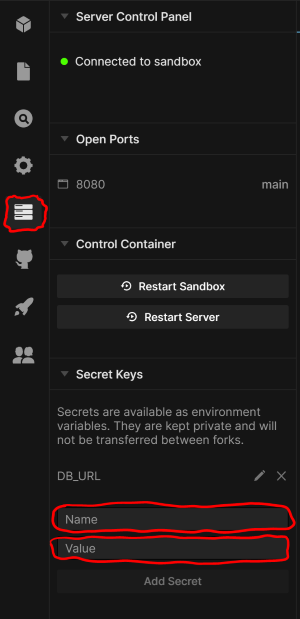

# Backend Interview Practice

```
You should only need to edit files in the `todo` folder
```

## Overview

This is a partial application that the student will complete to get all the tests passing

## Setup

- Open a new terminal and run `npm install`
- Create a new database instance in [elephant sql](https://www.elephantsql.com/)
- Go into the `Server Control Panel` and add `DB_URL` and your `elephant sql url` to the name and value section.  
  
- Click the `Add Secret` button.
- Run the command `npm run migrate` to create the database tables. If prompted for a password, just press enter.
- run the command `npm t`
- You should see output from 10 integration tests, some will be failing.

## Exercise

1. Add the GET (all) endpoint.
2. Add the GET (id) endpoint.
3. Add the POST endpoint.

You have completed the task when all the unit tests pass.
